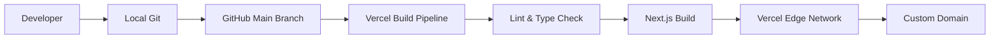

# Deployment Strategy

The portfolio is deployed on **Vercel** for optimal Next.js performance and CI/CD integration.

## Deployment Architecture

## Vercel Workflow
1. Push changes to the `main` branch.
2. Vercel automatically intercepts the webhook.
3. Vercel runs `npm run build`.
4. If successful, the new build is deployed to production.
