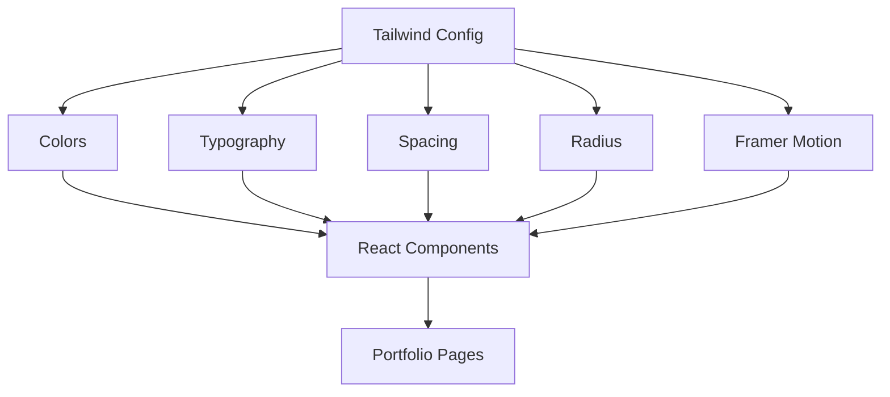

# Design System: Editorial Engineering Luxury

The portfolio follows an **Editorial Engineering Luxury** design direction.

The objective is to combine:
* Technical precision
* Premium visual presentation
* Editorial typography
* Clean information hierarchy
* Minimal visual noise

## Design Principles

| Principle | Implementation |
|-----------|----------------|
| **Clarity** | Clear visual hierarchy using semantic HTML |
| **Precision** | Consistent spacing and alignment via Tailwind CSS |
| **Restraint** | Limited decorative elements |
| **Readability** | Strong typography and contrast |
| **Responsiveness**| Fluid layouts across screen sizes |
| **Performance** | Lightweight assets and animations |

## Design Token Architecture

