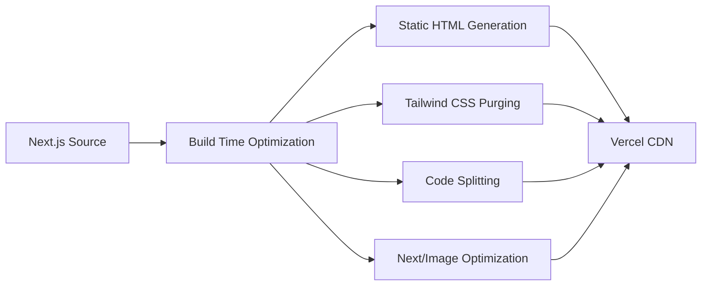

# Performance Strategy

Performance is an important component of the portfolio architecture.

## Performance Pipeline

## Key Optimizations
* **Images:** Uses `next/image` for automatic format selection (WebP/AVIF), lazy loading, and responsive sizing.
* **Fonts:** Uses `next/font` to optimize font loading and prevent layout shifts.
* **CSS:** Tailwind CSS ensures only used styles are shipped in the final bundle.
